<div align="center">

# 16-Bit Barrel Shifter (barrel_shifter_16) - Complete RTL-to-GDSII ASIC Flow 🚀
### A Silicon Journey: From Hierarchical Multiplexer Trees to Sky130 Manufacturing-Ready Layout

[](https://github.com/The-OpenROAD-Project/OpenLane)
[](https://github.com/google/skywater-pdk)
[](#)
[](#)

*Documenting the complete physical design realization of a high-performance, structural 16-bit Barrel Shifter macro block using the open-source OpenLane toolchain and SkyWater 130nm standard cell library.*

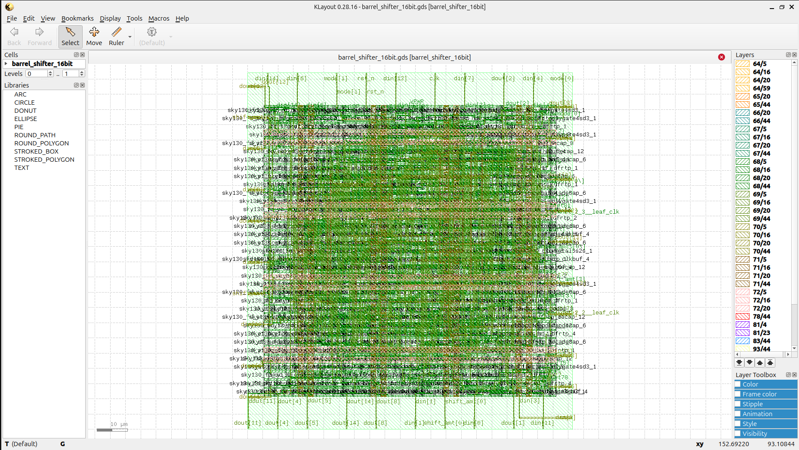

---

**[Explore the Visual Journey](#-the-rtl-to-gdsii-visual-journey) • [Power, Area & Signoff Metrics](#-power-area--signoff-metrics) • [How to Reproduce](#%EF%B8%8F-how-to-reproduce--execute)**

</div>

---

## 💡 Project Overview & Microarchitecture

A **16-Bit Barrel Shifter (barrel_shifter_16)** is a critical combinational acceleration unit used extensively in microprocessors (ALUs), floating-point units, and DSP pipelines. Unlike standard sequential shift registers that take up to $N$ clock cycles to shift a bit vector by $N$ bits, a Barrel Shifter executes logical left shifts (LSL), logical right shifts (LSR), and arithmetic right shifts (ASR) arbitrarily across a full range within a **single combinational step**.

To maximize layout efficiency and limit cell delays across rows, this macro implements an optimized **Multi-Stage Multiplexer Routing Tree Layer Network**:
* **Stage 0 (LSB Layer):** Conditionally shifts incoming data by 1 bit if shift amount bit `shift_amt[0]` is active.
* **Stage 1:** Conditionally shifts structural intermediate tracks by 2 bits if `shift_amt[1]` is active.
* **Stage 2:** Conditionally shifts structural intermediate tracks by 4 bits if `shift_amt[2]` is active.
* **Stage 3 (MSB Layer):** Conditionally shifts structural intermediate tracks by 8 bits if `shift_amt[3]` is active.

By decoupling the data shifting array from multi-level sequential looping clocks, the critical path propagation lag is bounded tightly to the total logical delay of just 4 cascading multiplexer gates.

---

## 🛠️ Tools & Technology Stack

| Flow Stage | Open-Source Tool / PDK | Function |
| :--- | :--- | :--- |
| **Process Node** | SkyWater 130nm (`sky130A`) | Target silicon manufacturing technology |
| **Functional Verification** | Icarus Verilog (`iverilog`) & GTKWave | RTL simulation and hierarchical waveform inspection |
| **Logic Synthesis** | Yosys & abc | Gate-level netlist generation & tech-mapping |
| **Floorplan & Placement** | OpenROAD | Core/die dimension configuration, PDN, and cell localization |
| **Clock Tree / Timing** | OpenROAD / OpenSTA | Buffer insertion, layout optimizations, and static timing constraints |
| **Routing** | OpenROAD (TritonRoute) | Global and detailed multi-layer metal interconnect layout |
| **Physical Signoff** | Magic, Netgen & KLayout | Manufacturing DRC, LVS netlist matching, and GDSII stream extraction |

---

## 📖 The RTL-to-GDSII Visual Journey

### 1️⃣ RTL Design & Functional Tree Verification
The operational integrity of the cascading multiplexer shifting grid was validated across intense operational modes. The simulation waveform confirms immediate, hazard-free updating of output ports as data signals adjust alongside active mode configurations.

<p align="center">
  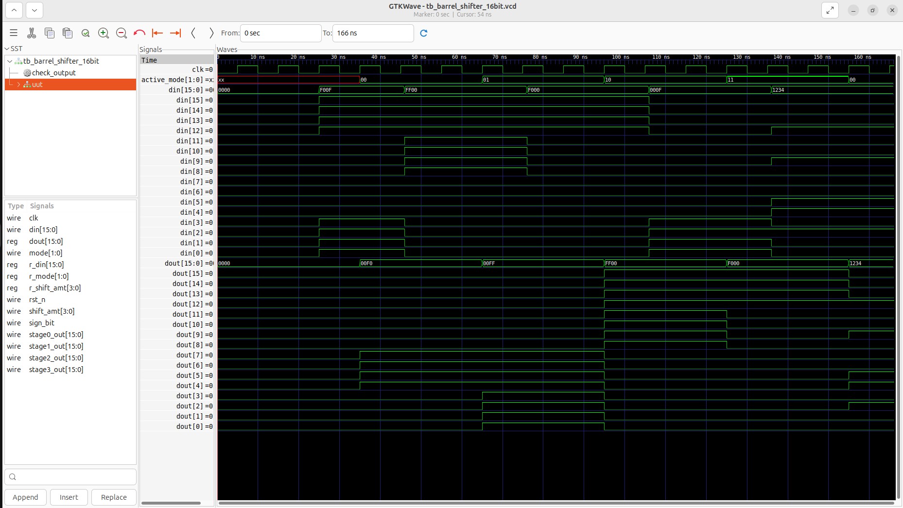
</p>

### 2️⃣ Floorplanning & Power Delivery Network (PDN)
Core utilization profiles are precisely bounded to optimize the cell layout channels. The PDN establishes a sturdy alternating topology of horizontal and vertical power straps (`VPWR`/`VGND`) to enforce uniform voltage rails during intensive parallel switching operations.

<p align="center">
  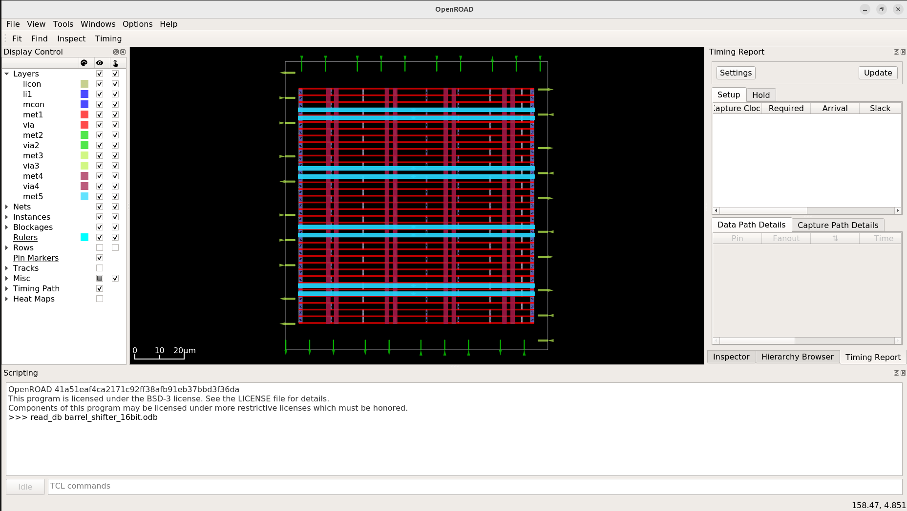
</p>

### 3️⃣ Global & Detailed Cell Placement
The 2-to-1 routing mux components and mode select arrays are systematically placed along the standard cell rows. The cell placement optimization balances row density to prevent wire congestion bottlenecks across cascading layers.

<p align="center">
  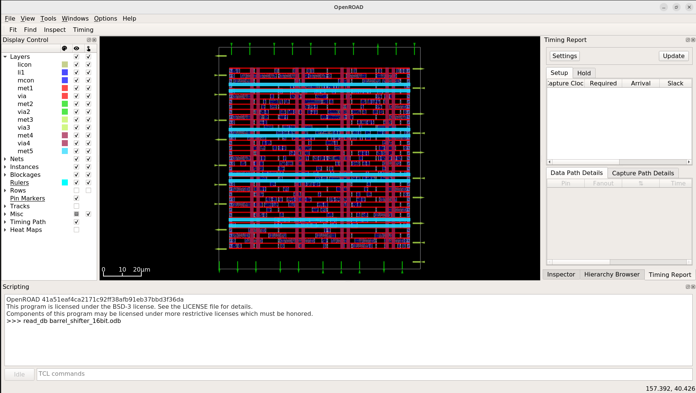
</p>

### 4️⃣ Clock Tree Synthesis (CTS) & Drive Buffering
Internal data tracks and mode flags are optimized for maximum timing performance. High-strength buffers are strategically integrated to smooth out layout capacitance loads and protect performance across data selection boundaries.

<p align="center">
  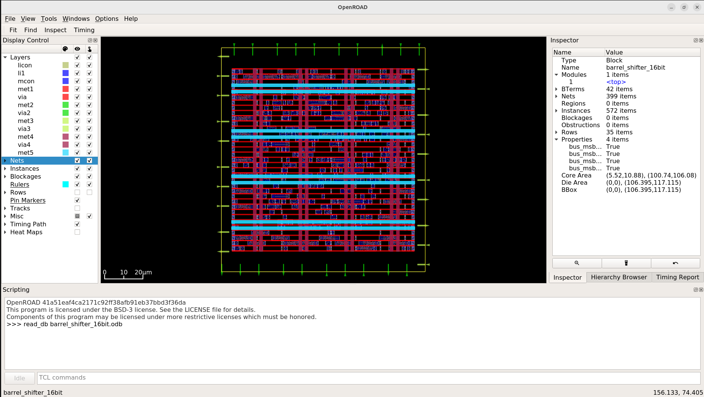
</p>

### 5️⃣ Interconnect Detailed Routing
The TritonRoute router organizes detailed connections across the multi-layer metal tracks. Data signals change routing levels cleanly through contact vias, maintaining exact spacing metrics to avoid cross-talk problems on parallel buses.

<p align="center">
  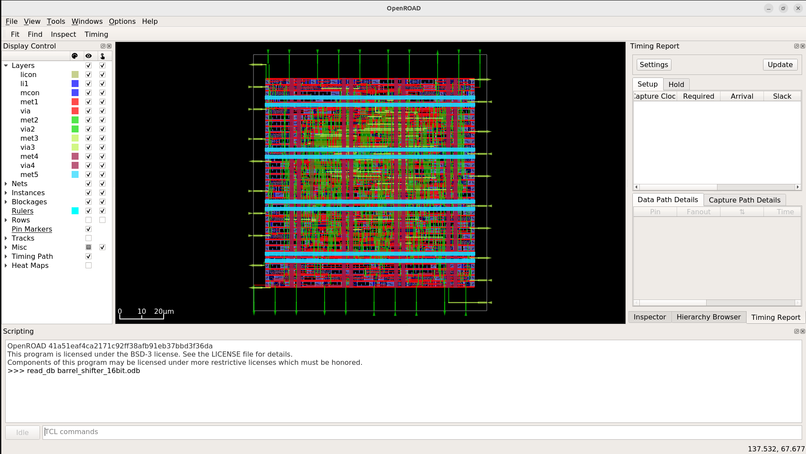
  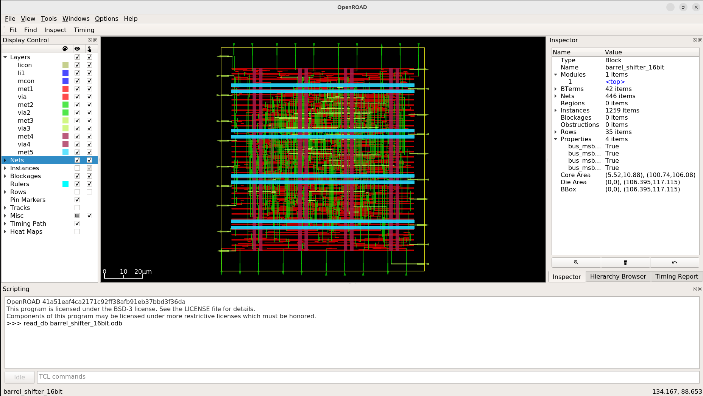
</p>

---

## 📊 Power, Area & Signoff Metrics

All physical design parameters are extracted directly from post-routing verification reports:

### 📐 Area & Density Reports
Core utilization profiles indicate tight cell nesting and highly optimized layout bounds:
* **Total Macro Gate Cell Count:** 324 standard cells placed across design rows.
* **Total Estimated Macro Area Profile:** $3637.238\ \mu\text{m}^2$.

<p align="center">
  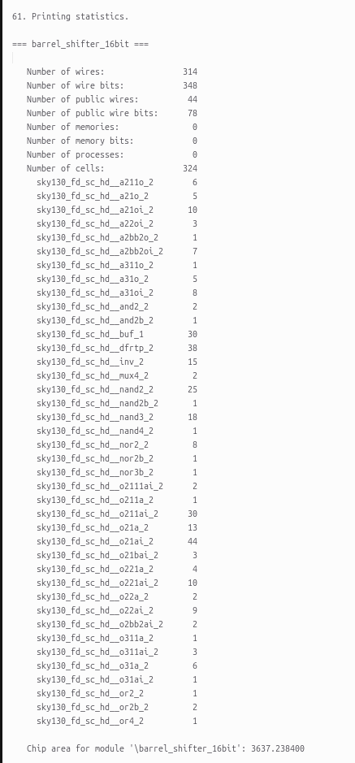
</p>

### ⚡ Power Consumption Summary
Post-routing power verification charts ultra-low leakage tolerances and a stable combinational dynamic grid profile:

* **Internal Power:** $9.17 \times 10^{-4}\text{ W}$ ($70.2\%$)
* **Switching Power:** $3.89 \times 10^{-4}\text{ W}$ ($29.8\%$)
* **Leakage Power:** $1.16 \times 10^{-9}\text{ W}$ ($0.0\%$)
* **Total Macro Power Consumption:** **$1.31 \times 10^{-3}\text{ W}$ ($1.31\text{ mW}$)**

<p align="center">
  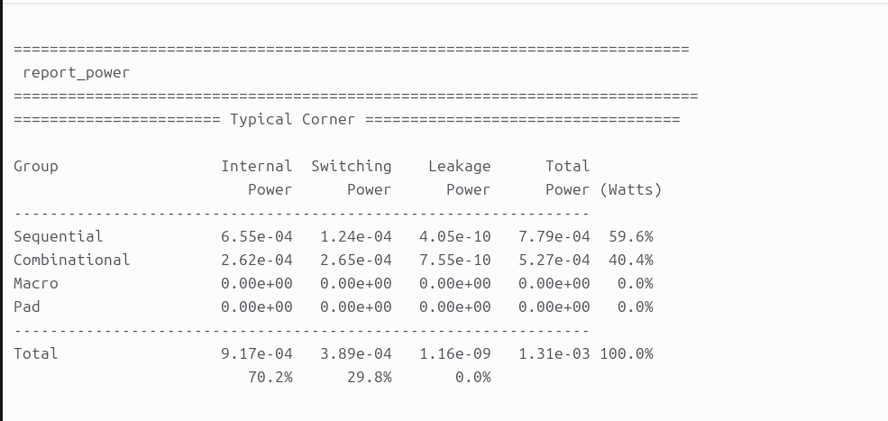
</p>

### 💯 Manufacturability Signoff (DRC/LVS)
The physical micro layout achieves full verification signoff metrics with zero errors across the backend execution path:
* **Total Magic DRC Violations:** 0
* **Layout vs. Netlist (LVS) Status:** Clean Match (All structural layout nets match perfectly with the synthesized netlist)
* **Antenna Violations:** 0

<p align="center">
  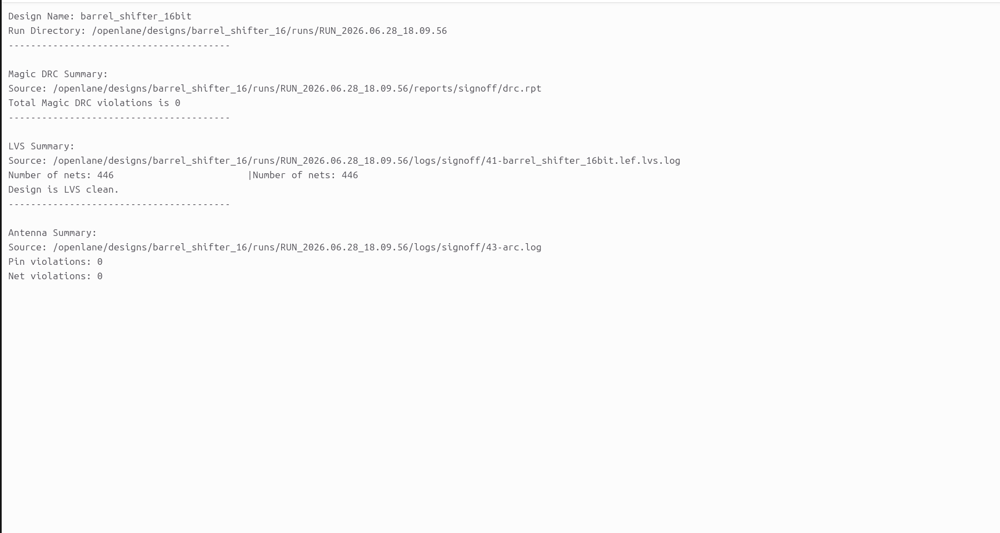
</p>

<p align="center">
  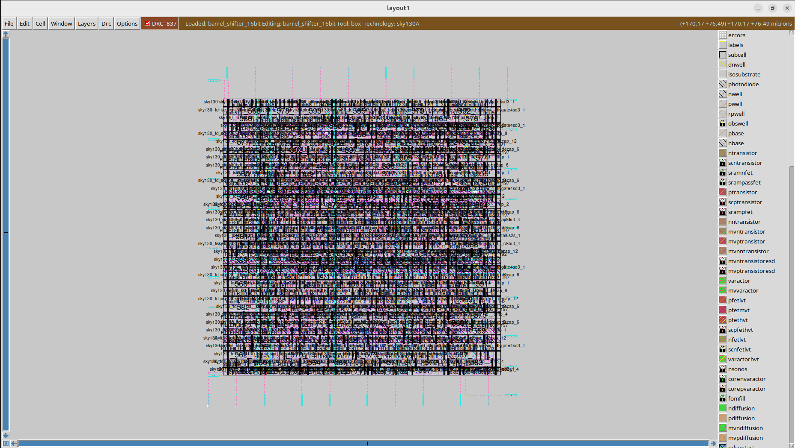
</p>

### 🛠️ Prototyping Target Profiles
The complete design footprint boundary and physical pinout placements are fully prepared, verified, and ready to target open-hardware prototyping formats like **Tiny Tapeout**.

<p align="center">
  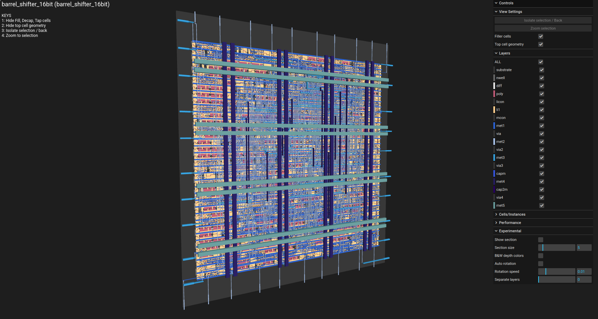
</p>

---

## 📂 Repository Structure

```text
├── barrel_ss/           # Visual reports, simulation waveforms, and layout screenshots
│   ├── area.png         # Design core area utilization log report
│   ├── cts.png          # Clock tree and buffer path optimization view
│   ├── drc.png          # Complete DRC & LVS signoff report snapshot
│   ├── floorplan.png    # Floorplan layout and power distribution network grid
│   ├── klayout.png      # GDSII manufacturing-ready layout view in KLayout
│   ├── magic.png        # Magic VLSI layout tool signoff execution view
│   ├── placement.png    # Standard cell row localization map
│   ├── power.png        # Static and dynamic power consumption analysis summary
│   ├── routing.png      # Complete interconnect routing trace layout
│   ├── routing2.png     # Zoomed-in detailed standard Net Trace layout
│   ├── tinny.png        # 3D perspective structure of physical silicon layers
│   └── waveforms.png    # GTKWave functional behavioral simulation trace results
├── src/                 # Behavioral Verilog source descriptions and testbench wrappers
│   ├── barrel_shifter_16.v
│   └── tb_barrel_shifter_16.v
├── config.json          # OpenLane design constraint and configuration parameters
├── constraints.sdc      # Timing and clock constraint rules
├── barrel_shifter_16.gds # Extracted foundry GDSII tapeout-ready stream layout file
└── README.md            # Main project documentation
```
## ⚙️ How to Reproduce & Execute
### 1️⃣ Run Behavioral Functional Verification

Compile the hardware description files using Icarus Verilog and verify operational behavior by viewing waveform traces in GTKWave:
```

# Compile the shifter source descriptions and testbench wrapper
iverilog -o tb_barrel src/barrel_shifter_16.v src/tb_barrel_shifter_16.v

# Run the simulation executable to generate the VCD dump file
vvp tb_barrel

# Load the signal traces into the GTKWave visualization window
gtkwave tb_barrel_shifter_16.vcd
```
### 2️⃣ Execute RTL-to-GDSII Physical Automated Synthesis Flow

Launch your local containerized OpenLane workspace directory to trigger the automated backend design flow toward generating the final GDSII stream file:
```

# Enter your local OpenLane installation directory path
cd <OpenLane_Root_Directory>

# Mount the interactive Docker container environment
make mount

# Launch the script runner to process the target barrel shifter macro layout
./flow.tcl -design barrel_shifter_16
```
## 🤝 Acknowledgments
### 🏷️ Open-Source EDA & PDK Ecosystem

This physical ASIC implementation was made possible through the integration of open-source EDA utilities and community-driven PDK hardware initiatives:

Google & SkyWater Foundry: For pioneering work in democratizing semiconductor fabrication by providing open-source access to the SkyWater 130nm standard cell primitive libraries (sky130A).

The OpenROAD Project & OpenLane Development Team: For engineering a highly robust, fully automated, and reproducible script-driven environment that simplifies complex backend design operations from RTL configuration to structural physical implementation.

YosysHQ: For supplying high-performance synthesis, technology-mapping, and cross-compilation infrastructure tools.

Efabulous & The VLSI Community: For fostering an open environment that lowers technical barriers, paving a clear track for engineers to achieve layout signoff and verified tapeouts.

## Author: Madhu Kumar

